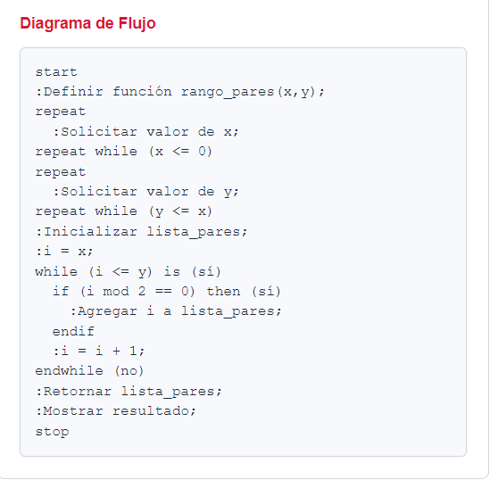
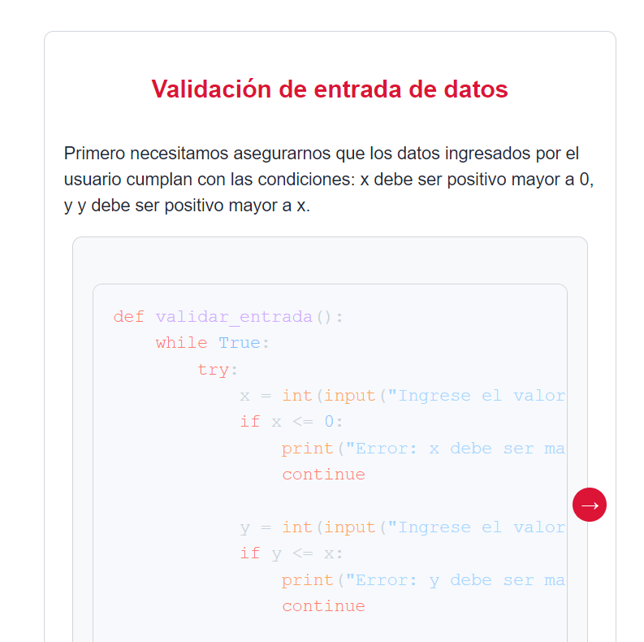

<h1>buddy: tu compañero en tus primeros pasos en la programación </h1>

*Buddy* es una extensión de VS Code que ayuda a los estudiantes a comprender mejor los problemas de programación. Funciona con Claude 3.5 Sonnet de Anthropic.

<table>
<tbody>
<td align="center">
<a href="https://marketplace.visualstudio.com/items?itemName=dprol.BuddyAI" target="_blank"><strong>Descarga Buddy en el VS Marketplace</strong></a>
</td>
<td align="center">
<a href="#" target="_blank"><strong>Documentación</strong></a>
</td>
</tbody>
</table>

  
  

---

### Conceptos clave

El asistente ofrece definiciones concisas y claras de conceptos fundamentales de programación directamente relacionados con el problema planteado. Estas definiciones complementan las explicaciones del instructor en clase, ayudando a los estudiantes a comprender mejor los conceptos.

 

### Ejemplos en pseudocódigo y diagrama de flujo

El asistente crea un ejemplo en pseudocódigo, acompañado de un diagrama de flujo, que ilustra la solución al problema planteado. Este enfoque permite comprender el problema de manera más clara al descomponerlo en pasos lógicos y visualizar su solución de forma estructurada.

 

### Pistas para empezar

El asistente ofrece al usuario una lista enumerada con tres pasos o pistas iniciales para abordar el problema. Estas indicaciones están diseñadas para orientar al usuario en cómo comenzar la solución y estructurar su enfoque de manera lógica.

 

### Sugerencias para el próximo paso

El asistente proporciona sugerencias específicas para el siguiente paso en el desarrollo del código, adaptadas al contexto del fragmento seleccionado por el usuario. Estas recomendaciones ayudan al usuario a avanzar en la resolución del problema, especialmente cuando no sabe cómo proceder o se encuentra atascado, guiándolo de manera práctica.

 

### Explicación de la solución

El asistente ofrece una explicación detallada de una solución posible, desglosando paso a paso el funcionamiento y la lógica que sustentan una respuesta correcta. Esto permite al usuario comprender profundamente el razonamiento detrás de la solución, independientemente de si su intento previo fue acertado o no, fortaleciendo así su conocimiento y habilidades en programación.

 

### Preguntas de seguimiento

El asistente formula tres preguntas de seguimiento relacionadas con el problema planteado, acompañadas de sus respectivas respuestas. Este enfoque fomenta una exploración más profunda del tema y ayuda al usuario a reflexionar sobre diferentes aspectos del problema, promoviendo un aprendizaje más integral.

 

## Contacto
💬 Por favor escribe [aquí](mailto:danielprolperez@gmail.com) para cualquier pregunta o sugerencia.