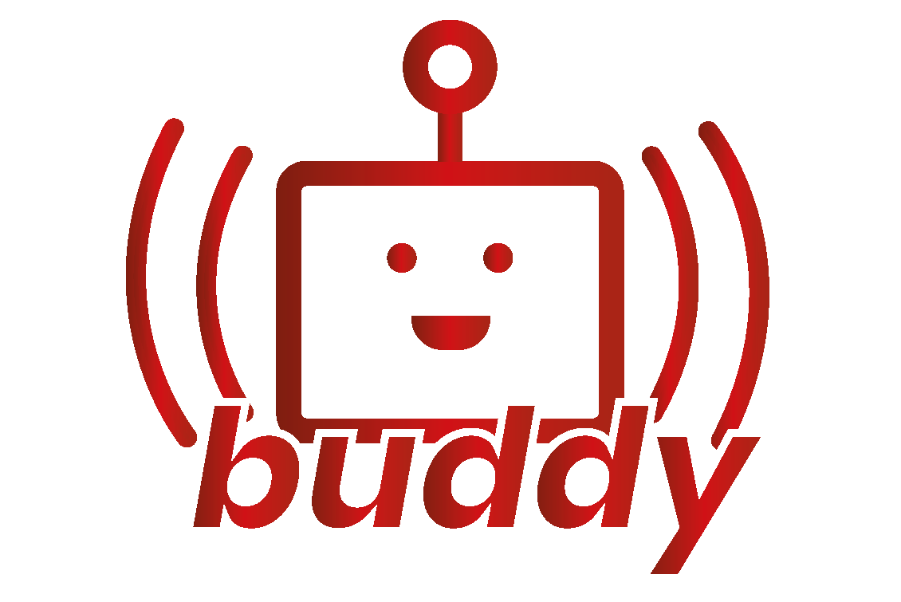

<h1 align="center">buddy</h1>

  
 
  

    El asistente de IA para VS Code diseñado específicamente para estudiantes universitarios que están aprendiendo programación básica.
  

  

    <a href="#características-principales">Características</a>
    ·
    <a href="#inicio-rápido">Inicio Rápido</a>
  

## Acerca de buddy

buddy es una extensión de VS Code que actúa como un compañero de aprendizaje personal para estudiantes universitarios que están dando sus primeros pasos en la programación. A diferencia de otros asistentes de IA, buddy está específicamente diseñado para el contexto educativo, proporcionando explicaciones paso a paso y fomentando buenas prácticas de programación desde el principio.

## Características Principales

- 🎓 **Enfoque Educativo**: Explicaciones detalladas y pedagógicas adaptadas al nivel universitario básico
- 💡 **Sugerencias Contextuales**: Ayuda proactiva basada en los errores comunes de principiantes
- 📚 **Recursos de Aprendizaje**: Enlaces a documentación y materiales adicionales relevantes
- ⚡ **Integración con VS Code**: Experiencia fluida dentro de tu entorno de desarrollo

## Inicio Rápido

1. Instala la extensión desde el [VS Code Marketplace](https://marketplace.visualstudio.com/)
2. Abre VS Code y busca "buddy" en la paleta de comandos
3. ¡Comienza a programar con tu nuevo compañero de aprendizaje!

## Contacto

Cuenta de github: [@dprol](https://github.com/dprol)

(<a href="#readme-top">volver arriba</a>)
