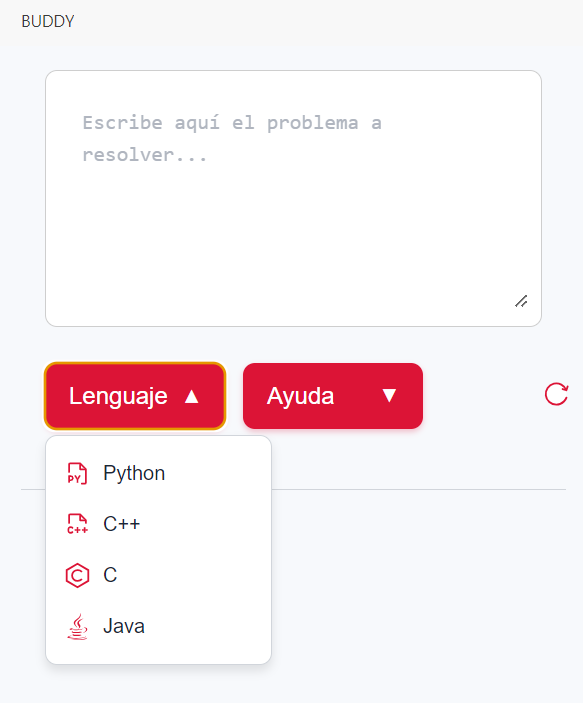
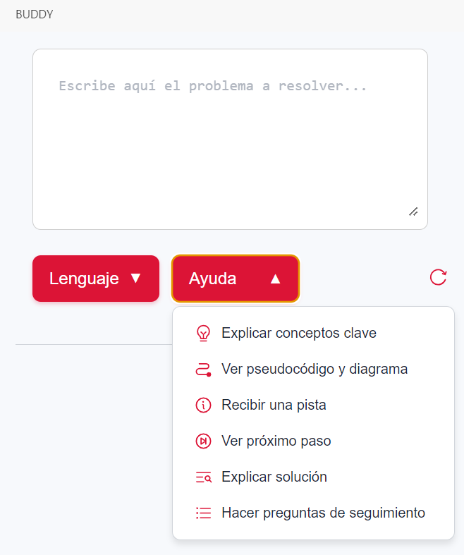
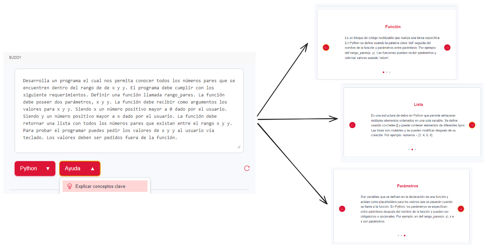
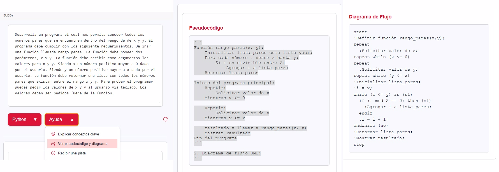
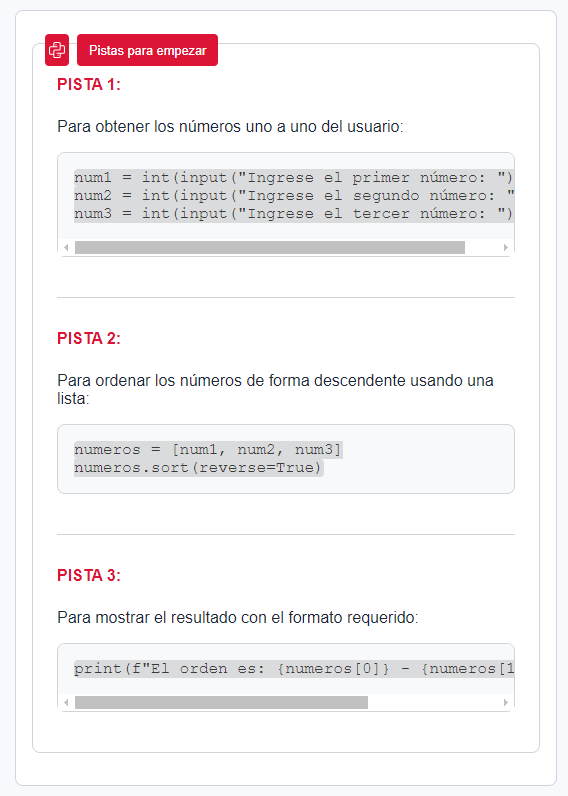
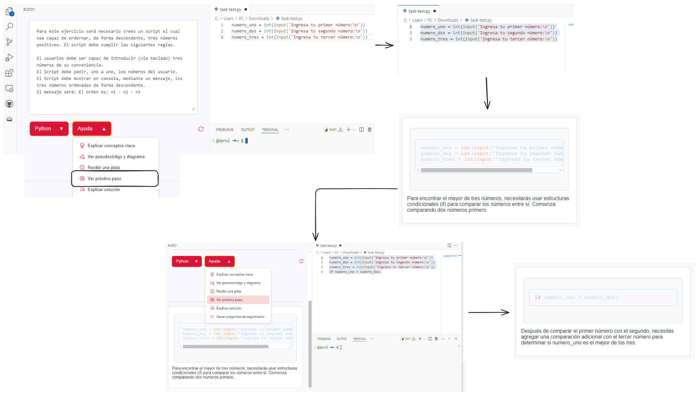
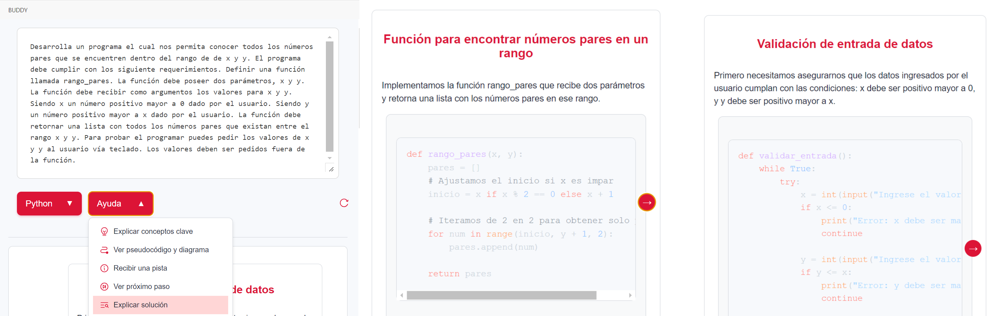
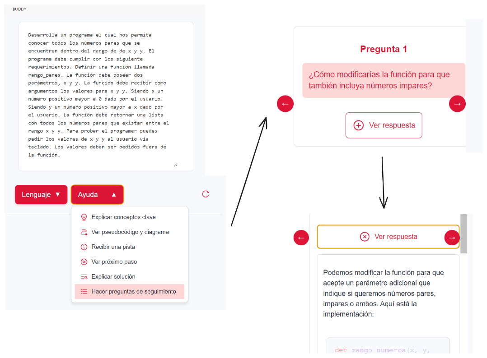

<h1>buddy: tu compañero en tus primeros pasos en la programación </h1>

*Buddy* es una extensión de VS Code que ayuda a los estudiantes a comprender mejor los problemas de programación. Funciona con Claude 3.5 Sonnet de Anthropic.

<table>
<tbody>
<td align="center">
<a href="https://marketplace.visualstudio.com/items?itemName=dprol.buddy-ai" target="_blank"><strong>Descarga Buddy en el VS Marketplace</strong></a>
</td>
<td align="center">
<a href="https://buddy-a805c3e6.mintlify.app/" target="_blank"><strong>Documentación</strong></a>
</td>
</tbody>
</table>

  
  

---

## Conceptos Clave

[Conceptos](https://buddy-a805c3e6.mintlify.app/essentials/conceptos) fundamentales de programación directamente relacionados con el problema planteado. Estas definiciones complementan las explicaciones del instructor en clase, ayudando a los estudiantes a comprender mejor los conceptos.

## Ejemplos en Pseudocódigo y Diagrama de Flujo

[Ejemplo](https://buddy-a805c3e6.mintlify.app/essentials/ejemplos) en pseudocódigo, acompañado de un diagrama de flujo, que ilustra la solución al problema planteado. Este enfoque permite comprender el problema de manera más clara al descomponerlo en pasos lógicos y visualizar su solución de forma estructurada.

## Pistas para empezar

[Pistas](https://buddy-a805c3e6.mintlify.app/essentials/pistas) iniciales para abordar el problema. Estas indicaciones están diseñadas para orientar al usuario en cómo comenzar la solución y estructurar su enfoque de manera lógica.

## Sugerencias para el próximo paso

[Sugerencias para el siguiente paso](https://buddy-a805c3e6.mintlify.app/essentials/next) en el desarrollo del código, adaptadas al contexto del fragmento seleccionado por el usuario. Estas recomendaciones ayudan al usuario a avanzar en la resolución del problema, especialmente cuando no sabe cómo proceder o se encuentra atascado, guiándolo de manera práctica.

## Explicación de la solución

[Explicación](https://buddy-a805c3e6.mintlify.app/essentials/solucion) detallada de una solución posible, desglosando paso a paso el funcionamiento y la lógica que sustentan una respuesta correcta. Esto permite al usuario comprender profundamente el razonamiento detrás de la solución, independientemente de si su intento previo fue acertado o no, fortaleciendo así su conocimiento y habilidades en programación.

## Preguntas de seguimiento
[Preguntas de seguimiento](https://buddy-a805c3e6.mintlify.app/essentials/preguntas) relacionadas con el problema planteado, acompañadas de sus respectivas respuestas. Este enfoque fomenta una exploración más profunda del tema y ayuda al usuario a reflexionar sobre diferentes aspectos del problema, promoviendo un aprendizaje más integral.

## Contacto
💬 Por favor escribe [aquí](mailto:danielprolperez@gmail.com) para cualquier pregunta o sugerencia.